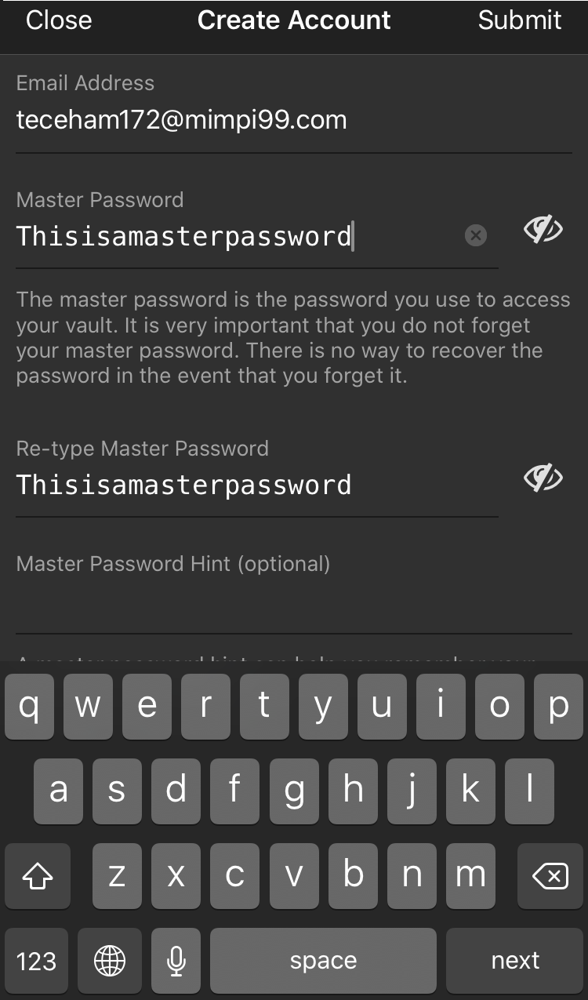
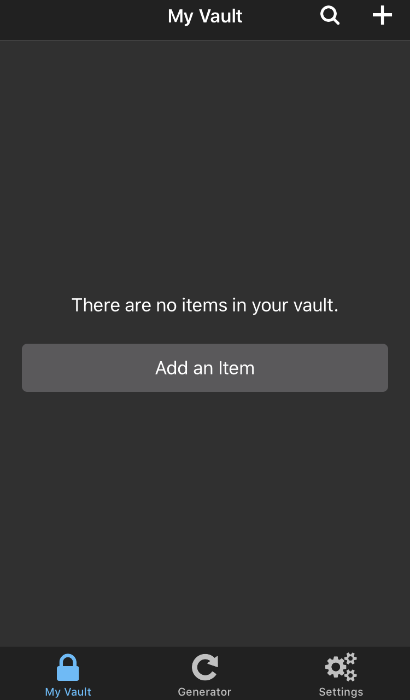
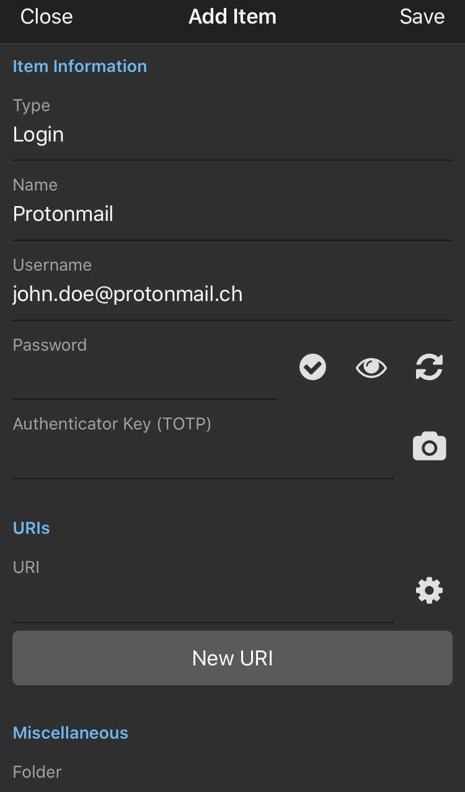
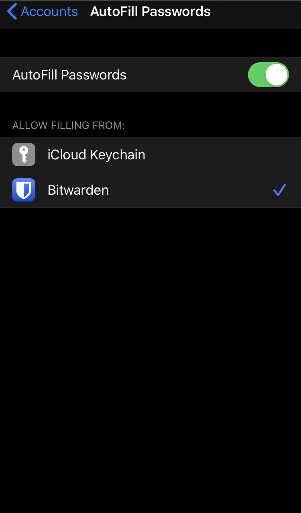

# Securing your accounts

The combination of username and password has long been the standard way of authenicating users when they log into a website, service, etc. This combination is what keeps our personal messages with friends and family, our emails, our pictures and all the rest that is online from being accessed by everyone. They are the gatekeepers to our online presence which is why it is so important that they are secure. We are tought many things in school, but nobody ever told us how to choose a good password and how to secure our online accounts so it is obvious that most people don't know how to do it. This is where this guide hopefully comes in handy.

## 1st Step: Get a Password Manager
The most important thing in my opinion is to have different passwords and possibily different emails and usernames for different websites. Since nowadays it is not unusual to have dozens of online accounts, it can be very hard to keep track of all login data. Here is where Password Managers come in. These are apps that can be installed on your phone, laptop or tablet where all your passwords are stored in one place. Some of them are more barebones and don't do a lot more than store passwords, others offer features like random password generation, password synchronization and password sharing. I have tried different password managers, but the best one I have found up until now has been Bitwarden. This password manager is Free and Open Source, but also offers paid plans for more advanced functionality. I reccomend starting with the free version, which is more than enough in the beginning. You can always upgrade later. 
Bitwarden is available on Android, IOS, Mac OS, Windows and Linux. It also offers a browser extension for Mozilla Firefox, Google Chrome and other Chromium based browsers. If you want to know more about Bitwarden, click [here](https://bitwarden.com/) to visit their website. They also regularly publish results from their Security Audits on their Blog (You can find the latest one [here](https://bitwarden.com/blog/post/bitwarden-network-security-assessment-2020/). This shows the companie's interest in being as transaprent as possbile, which is a must if you need to put so much trust in an application. 

## 2nd Step: Choose a strong Master Password
Once you have downloaded the Bitwarden App from the Google PlayStore, Apple Appstore or whatever store you might be using, you need to create an Account. The Master Password in conjunction with your email address is what is needed to access your Vault. The Vault is where all of your passwords are stored. It goes without saying that this password needs to be extremely secure. One common misconception is that for a password to be secure it needs to be hard to remember and some weird combination of characters. This is true of your other passwords in your Vault, but not for your Master Password. Instead of thinking of it as a pass**word**, I would rather think of it as a pass**phrase**. The way an attacker will crack your password is either by using a Wordlist attack, a Brute-force attack or through Social Engineering. The latter is (possibly) mitigated by using things like Two Factor Authentication, the former two are what a good passphrase should prevent. The longer your passphrase, the more possible combinations there exist and thus the longer it will take for a computer to crack it. What I do is I try to think of a silly but easy to remember phrase. An example could be: "_Fred Westerson walks on rotten Bananas_". I hope there is nobody out there called Fred Westerson, but for some reaso that is what I came up with spontaneously. This passphrase should take around 10,826,447,514,211,228 centuries to crack. Pretty secure, right?

## 3rd Step: Start changing your passwords
This is probably the most tedious part since you need to go in and change every password from every online account you have. I suggest you do this step by step and change a password the next time you use an account.
If you had to think about a new random password for each account, you'd run out of words to use fairly quickly. This is why Bitwarden (and other password managers) have a password generation feature. Just go into the app, create a new password and click on the circular arrows next to the password box. I suggest you to use a password that has around 25 characters and that uses numbers, upper and lower case letters as well as special symbols. This way you have a very secure password, but not too long so that it is impossible to type out if you cannot copy paste it once for some reason.

## Extra Tips and Tricks
### Change your autofill service
If you want to make your life that much easier, change your default Autofill Service to be Bitwarden. This way you get prompted to "Autofill with Bitwarden" if you ever have to login somewhere.
#### On IOS
Go to Settings > Passwords & Accounts > Autofill Passwords > Choose Bitwarden from the list
{: align=right }

#### On Android
Open the Bitwarden App > Click on Settings > Click on Auto-fill Service to enable it (follow the instructions) > go back to the settings and click on Auto-fill Accessibility Service to enable it (again follow the instructions)

### Install the extension for your browser on your Laptop or Desktop

Do a quick DuckDuckGo Search (or Google Search if you are still using Google) for "Bitwarden Extenstion [Your Browser Name]" replacing the sqaure brackets with the name of the browser you are using and install the extension. Please make sure that the extension is the original from the original developers (you can also tell that if it has like 50 downloads, it's probably going to be fake) since that would really suck if you typed in your Masterpassword and Email in a fake version of the app. 

### Enable Biometrics
This is totally up to you. If you want to have a bit of an easier time, go to settings and turn on "Unlock with Biometrics" to use FaceID or your Fingerprint to unlock your vault. Be aware though, that this is going to make your Vault less secure if someone where to get his hands on your phone. You need to judge for yourself, if this is a worthwile risk you want to accept. In my opinion, if you are not a high profile person that might be directly targeted (like maybe a Journalist, Lawyer, etc.) and forced to unlock your phone and password manager, you will be fine with this option turned on. But don't quote me on that :wink:

### For the Nerds, Neckbeards and Paranoid: Self Hosting
Bitwarden can also be self hosted on a server of your choosing. Go [here](https://bitwarden.com/help/article/install-on-premise/) to find isntructions on self hosting your own instance of bitwarden.
